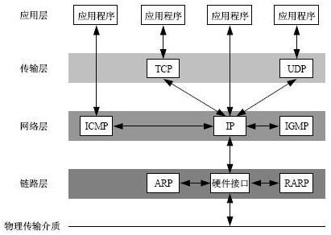
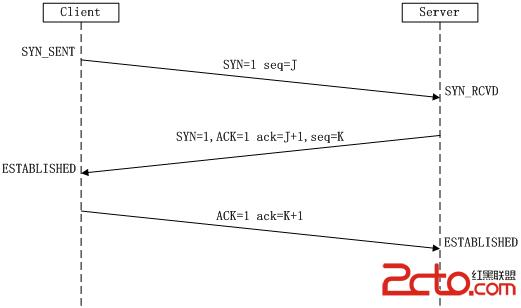
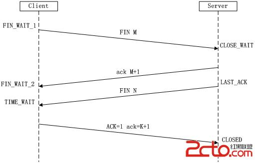

# TCP/IP和UDP/IP

### tcp/ip 基本概念

> 分布式系统本质基于网络通信组成的超级计算机

> TCP/IP（Transmission Control Protocol/Internet Protocol）是一种**可靠的网络数据传输控制协议**。

> 定义了主机如何连入因特网以及数据如何在他们**之间传输的标准**。

>  **OSI模型**（开放式系统互联通信参考模型），它是由国际标准化组织提出的，试图使各种计算机在世界范围内互联为网络的标准框架

>  OSI模型多了表达层、会话层

> TCP/IP协议参考模型把所有TCP/IP系列协议归类到**四个抽象层**中； 

> 每一个抽象层建立在**低**一层提供的服务上，并且为**高**一层提供**服务**

- ICMP:控制报文协议
- IGMP:internet组管理协议
- ARP:地址解析协议
- RARP:反向地址转化协议

### TCP 三次握手

> 所谓三次握手（Three-Way Handshake）即建立TCP连接，就是指建立一个TCP连接时，需要客户端和服务端总共发送3个包以确认连接的建立

#### 第一次握手

> Client将标志位SYN置为1，随机产生一个值seq=J，并将该数据包发送给Server，Client进入SYN_SENT状态，等待Server确认。

#### 第二次握手

> Server收到数据包后由标志位SYN=1知道Client请求建立连接，Server将标志位SYN和ACK都置为1，ack=J+1，随机产生一个值seq=K，并将该数据包发送给Client以确认连接请求，Server进入SYN_RCVD状态。

#### 第三次握手

> Client收到确认后，检查ack是否为J+1，ACK是否为1，如果正确则将标志位ACK置为1，ack=K+1，并将该数据包发送给Server，Server检查ack是否为K+1，ACK是否为1，如果正确则连接建立成功，Client和Server进入ESTABLISHED状态，完成三次握手，随后Client与Server之间可以开始传输数据了。

#### SYN攻击

>  在三次握手过程中，Server发送SYN-ACK之后，收到Client的ACK之前的TCP连接称为半连接（half-open connect），此时Server处于SYN_RCVD状态，当收到ACK后，Server转入ESTABLISHED状态。SYN攻击就是Client在短时间内伪造大量不存在的IP地址，并向Server不断地发送SYN包，Server回复确认包，并等待Client的确认，由于源地址是不存在的，因此，Server需要不断重发直至超时，这些伪造的SYN包将产时间占用未连接队列，导致正常的SYN请求因为队列满而被丢弃，从而引起网络堵塞甚至系统瘫痪。SYN攻击时一种典型的DDOS攻击，检测SYN攻击的方式非常简单，即当Server上有大量半连接状态且源IP地址是随机的，则可以断定遭到SYN攻击了，使用如下命令可以让之现行：

> netstat -nap | grep SYN_RECV

### TCP 四次挥手

> 终止TCP连接，就是指断开一个TCP连接时，需要客户端和服务端总共发送4个包以确认连接的断开

> **单工**
>
> > 数据传输只支持数据在一个方向上传输
>
> **半双工**
>
> > 数据传输允许数据在两个方向上传输，但是在某一时刻，只允许在一个方向上传输，实际上有点像切换方向的单工通信
>
> **全双工**
>
> > 数据通信允许数据同时在两个方向上传输，因此全双工是两个单工通信方式的结合，它要求发送设备和接收设备都有独立的接收和发送能力

> 由于TCP连接时全双工的，因此，每个方向都必须要单独进行关闭，这一原则是当一方完成数据发送任务后，发送一个FIN来终止这一方向的连接，收到一个FIN只是意味着这一方向上没有数据流动了，即不会再收到数据了，但是在这个TCP连接上仍然能够发送数据，直到这一方向也发送了FIN。首先进行关闭的一方将执行主动关闭，而另一方则执行被动关闭，

#### 第一次挥手

> Client发送一个FIN，用来关闭Client到Server的数据传送，Client进入FIN_WAIT_1状态。

#### 第二次挥手

> Server收到FIN后，发送一个ACK给Client，确认序号为收到序号+1（与SYN相同，一个FIN占用一个序号），Server进入CLOSE_WAIT状态。

#### 第三次挥手

> Server发送一个FIN，用来关闭Server到Client的数据传送，Server进入LAST_ACK状态。

#### 第四次挥手

> Client收到FIN后，Client进入TIME_WAIT状态，接着发送一个ACK给Server，确认序号为收到序号+1，Server进入CLOSED状态，完成四次挥手。

### TCP通信原理

#### 缓冲区

#### 滑动窗口

# 总结

基本概念总结：

>  