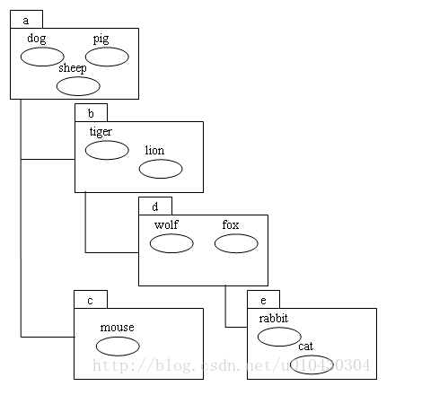
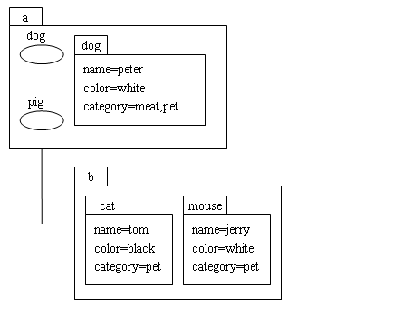

# Java之JNDI详解

> ​       JNDI是Java Naming and Directory Interface（JAVA命名和目录接口）的英文简写，它是为JAVA应用程序提供命名和目录访问服务的API（Application Programing Interface，应用程序编程接口）。

## 命名的概念与应用 

### 基本概念

> JNDI中的命名（Naming），就是将Java对象以某个名称的形式绑定（binding）到一个容器环境（Context）中，以后调用容器环境（Context）的查找（lookup）方法又可以查找出某个名称所绑定的Java对象。
>
> 你会感到奇怪：自己创建一个Java对象，将其绑定到JNDI容器环境中后又查询出来，这有什么意思？
>
> 在真实的项目应用中，通常是由系统程序或框架程序先将资源对象绑定到JNDI环境中，以后在该系统或框架中运行的模块程序就可以从JNDI环境中查找这些资源对象了。


> 总结：将对象命名绑定到容器环境中。通过命名查找对象

#### 容器的嵌套

>  容器环境（Context）本身也是一个Java对象，它也可以通过一个名称绑定到另一个容器环境（Context）中。
>
> 将一个Context对象绑定到另外一个Context对象中，这就形成了一种父子级联关系，多个Context对象最终可以级联成一种树状结构，树中的每个Context对象中都可以绑定若干个Java对象




> 图中每个方框分别代表一个Context对象
>
> > 它们绑定的名称分别为a、b、c、d、e
> >
> > b和c是a的子Context
> >
> > d是b的子Context
> >
> > e又是d的子Context


> 各个方框内的每个小椭圆分别代表一个Java对象，它们也都有一个绑定的名称，这些绑定名称分别为dog、pig、sheet等
>
> 在**同一个Context不能绑定两个相同名称的Java对象**，在不同的Context中可以出现同名的绑定对象。
>
> 可见，Context树的级联结构与文件系统中的目录结构非常类似，Context与其中绑定的Java对象的关系也非常类似于文件系统中的目录与文件的关系。
>
> 从图中可以看到，要想得到Context树中的一个Java对象，首先要得到其所在的Context对象，
>
> 只要得到了一个Context对象，就可以调用它的查询（lookup）方法来获得其中绑定的Java对象。
>
> 另外，调用某个Context对象的lookup方法也可以获得Context树中的任意一个Context对象，这只需要在lookup方法中指定相应的Context路径即可。
>
> 在**JNDI中不存在着“根”Context的概念**，也就是说，执行JNDI操作不是从一个“根”Context对象开始，而是可以从Context树中的任意一个Context开始。
>
> 无论如何，程序必须获得一个作为操作入口的Context对象后才能执行各种JNDI命名操作，为此，JNDI API中提供了一个**InitialContext类来创建用作JNDI命名操作的入口Context对象**。
>
> Context是一个接口，Context对象实际上是Context的某个实现类的实例对象，选择这个具体的Context实现类并创建其实例对象的过程是由一个Context工厂类来完成的，这个工厂类的类名可以通过JNDI的环境属性java.naming.factory.initial指定，也可以根据Context的操作方法的url参数的Schema来选择。


### 应用

> Tomcat服务器在启动时可以创建一个连接到某种数据库系统的数据源（DataSource）对象，并将该数据源（DataSource）对象绑定到JNDI环境中
>
> 以后在这个Tomcat服务器中运行的Servlet和JSP程序就可以从JNDI环境中查询出这个数据源（DataSource）对象进行使用，而不用关心数据源（DataSource）对象是如何创建出来的，
>
> 这种方式极大地增强了系统的可维护性，当数据库系统的连接参数发生变更时，这只是Tomcat系统管理员一个人要关心的事情，而与所有的应用程序开发人员无关。 


## 目录的概念与应用


> JNDI中的目录（Directory）与文件系统中的目录概念有很大的不同
>
> > JNDI中的目录（Directory）是指将一个对象的所有属性信息保存到一个容器环境中
>
> JNDI的目录（Directory）原理与JNDI的命名（Naming）原理非常相似
>
> > 主要的区别在于目录容器环境中保存的是对象的属性信息，而不是对象本身，所以，目录提供的是对属性的各种操作。
>
> JNDI的目录（Directory）与命名（Naming）往往是结合在一起使用的
>
> JNDI API中提供的代表目录容器环境的类为DirContext，DirContext是Context的子类
>
> > 显然它除了能完成目录相关的操作外，也能完成所有的命名（Naming）操作。
>
> DirContext是对Context的扩展，它在Context的基础上增加了对目录属性的操作功能，可以在其中绑定对象的属性信息和查找对象的属性信息。



>  图中的每个最外层的方框分别代表一个DirContext对象
>
> > 它们绑定的名称分别为a、b，b是a的子DirContext。
>
> 图中的各个最外层的方框内的每个小椭圆分别代表一个Java对象，各个里层的方框分别代表一个对象的属性。
>
> 从名称为a的DirContext中的内容可以看到，一个DirContext容器环境中即可以绑定对象自身，也可以绑定对象的属性信息
>
> 绑定的对象和绑定的属性是完全独立的两个事物，即使它们的绑定名称相同，它们的操作也是完全独立的。
>
> 另外，一个属性可以有多个属性值，例如，dog对象的category属性就设置了两个属性值：meat和pet。
>
> 从名称为b的DirContext中的内容可以看到，一个DirContext容器环境中也可以只绑定对象的属性信息，而不绑定任何对象自身。与Context的操作原理类似，JNDI API中提供了一个InitialDirContext类来创建用作JNDI命名与目录属性操作的入口DirContext对象。


# Java:comp/env/讲解与JNDI

#### 获取两种方式

##### context.lookup("java:comp/env/xxx") 

- context.lookup("java:comp/env/xxx")只能用在J2EE环境

- 自己写一个main函数，想通过context.lookup("java:comp/env/xxx")这样的方式来访问JNDI服务，这是不可能的。

##### context.lookup("xxx")

> context.lookup("xxx")在任何时候都是有效的，只要xxx确实是一个存在的JNDI名。


#### J2EE环境（java:comp/env/）

> java:comp/env/是一个J2EE环境的定义，说白了就是代表当前J2EE应用的环境
>
> 比如你自己项目的Web环境或者是EJB环境。那是不是只要是个Web项目，就能用context.lookup("java:comp/env/xxx")这种方式访问JNDI服务了呢？也不是！！！

> 使用这样的方式必须设置当前应用环境到资源名的映射。 在web.xml文件中有这样的标签：

```xml
<resource-env-ref></resource-env-ref>   
<resource-ref></resource-ref>   
<ejb-local-ref></ejb-local-ref>    
<ejb-ref></ejb-ref> 
```

> 这些标签就是用来建立当前应用环境到服务器资源的映射的。
>
> 有了这样的映射之后，就能采用context.lookup("java:comp/env/xxx")的方式来访问JNDI资源了。

##### 总结

1. web环境与ejb环境
2. 有特定的标签


# tomcat + JNDI 

#### context.xml

> 在context.xml的根节点Context里加入Resource配置

```xml
  <Resource name="jdbc/mysql"       //指定的jndi名称，会用于spring数据源bean的配置和ResourceLink的配置
                 auth="Container"//认证方式，一般默认这个
                 type="javax.sql.DataSource"   //数据源床型，使用标准的javax.sql.DataSource
                 driverClassName="com.mysql.jdbc.Driver"    //JDBC驱动器 
                 url="jdbc:mysql://localhost:3306/test" //数据库URL地址             
                 username="test"     //数据库用户名
                 password="test"   //数据库密码
                 maxIdle="40"   //最大的空闲连接数
                 maxWait="4000" //当池的数据库连接已经被占用的时候，最大等待时间
                 maxActive="250" //连接池当中最大的数据库连接
                 removeAbandoned="true" 
                 removeAbandonedTimeout="180"
                 logAbandoned="true" //被丢弃的数据库连接是否做记录，以便跟踪
                 factory="org.apache.tomcat.dbcp.dbcp.BasicDataSourceFactory" />
```


#### java

```java
Context context = new InitialContext();
DataSource dataSource = (DataSource)context.lookup("java:comp/env/jdbc/mysql");
System.out.println(dataSource);
```

#### 其他数据源的配置

> factory：该Resource 配置使用的是哪个数据源配置类，这里使用的是tomcat自带的标准数据源Resource配置类，这个类也可以自己写，实现javax.naming.spi.ObjectFactory 接口即可。
>
> 如果使用其他的数据池，如阿里巴巴的druid，要满足两个条件：
>
> 1. 其实现了javax.naming.spi.ObjectFactory，druid的com.alibaba.druid.pool.DruidDataSourceFactory就实现了
> 2. 需把jar**及其依赖的jar包** ，都放在tomcat的lib下，光放在工程的WEB-INF/lib下是不够的。阿里巴巴的druid依赖log4j，所以后者的jar也要复制进去


# spring + JNDI

```xml
<bean id="testDataSource" class="org.springframework.jndi.JndiObjectFactoryBean">
     <property name="jndiName">
          <value>java:comp/env/jdbc/mysql</value>
     </property>
</bean>
```

