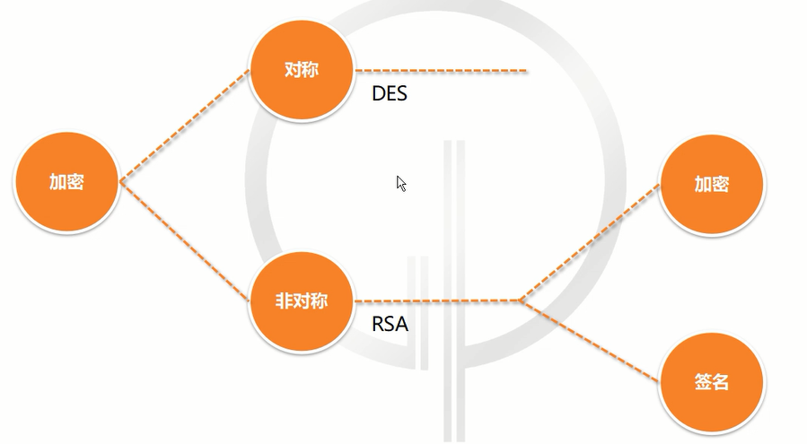
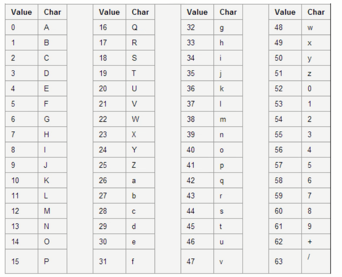
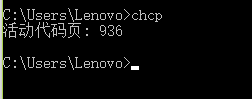
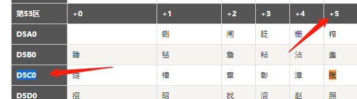
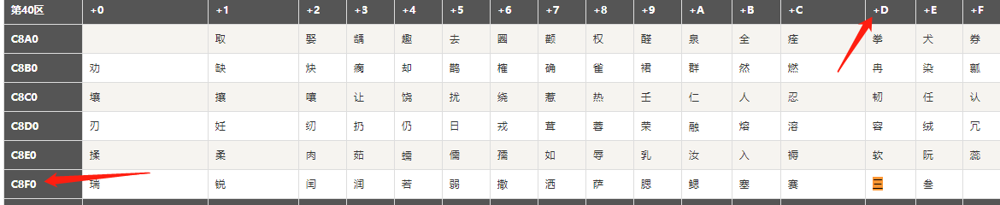

# 接口安全策略

### 为什么要开放API

> 常见的接口：
>
> - 短信接口
> - 付款接口
> - 开放SDK
> - 数据接口

### 开放API存在的安全问题

> 数据安全；身份验证；爬虫；系统安全；调用频率；Oath 鉴权；恶意攻击

> 数据窃取：窃取用户密码信息，获得敏感信息盗刷
>
> 数据篡改：提交的数据被抓包，篡改之后再提交
>
> 数据泄露：爬虫抓取业务数据甚至核心数据，造成直接或间接损失

### 如何让开发的API不再裸奔

> RAS / DES ： 用公私钥加解密，解决数据窃取
>
> MD5： 不可逆混淆算法，解决数据篡改
>
> 令牌：每次请求携带TONKEN，解决数据泄露

#### 数据窃取

> 对称加密（DES）
>
> > 值不变的情况，每次加密的结果都是一样的
>
> 非对称加密(RSA)
>
> > 值不变的情况，每次加密的结果都不一样

##### RSA

###### RSA加密

  ###### 签名

 ##### BASE64

> Base64是一种任意二进制到文本字符串的编码方法，常用于在URL、Cookie、网页中传输少量二进制数据
>
> Base64是一种最常见的二进制编码方法。

> 在UTF-8中汉字占3个字节
>
> 3 * 8
>
> 00000000    11111111
>
> > 0 - 255
>
> 4 * 6 
>
> 000000  111111
>
> > 0 -63   （64个值）

###### BASE64编码表

###### 实践BASE64编码

> 将《张三》进行BASE64编码
>
> 已window系统为列

- 找到中文字符在操作系统中对应的字符集的十进制编码

1. 运行chcp 找到系统的活动代码页代码，通过活动代码页找到系统对应的字符集

> 活动代码页 与 字符集编码对照表
>
> https://blog.csdn.net/yelbosh/article/details/7518484

> 936 所对应的编码为 
>
> >  中国 - 简体中文(GB2312)

2. 通过字符集找到汉字所对应的十进制编码

> GB2312简体中文编码表
>
> http://tools.jb51.net/table/gb2312

- 将十进制转为二进制

  张

  > 十六进制
  >
  > >  D5C0  + 5
  >
  > 十进制
  >
  > > 54720  +  5
  >
  > 二进制
  >
  > > 1101010111000101

  三

  >
  >
  > 十六进制
  >
  > > C8F0 + D
  >
  > 十进制
  >
  > > 51440 +  13
  >
  > 二进制
  >
  > > 1100100011111101

- 对二进制进行重组

张

> 1101010111000101

三

> 1100100011111101

>  11010101110001011100100011111101
>
> 110101      011100     010111    001000    111111   010000

- 重组之后再base编码中查找对象的字符，组成Base64编码字符

> 110101      011100     010111    001000    111111   010000

#### 数据篡改

#### 数据泄露

### Open API 设计技巧

