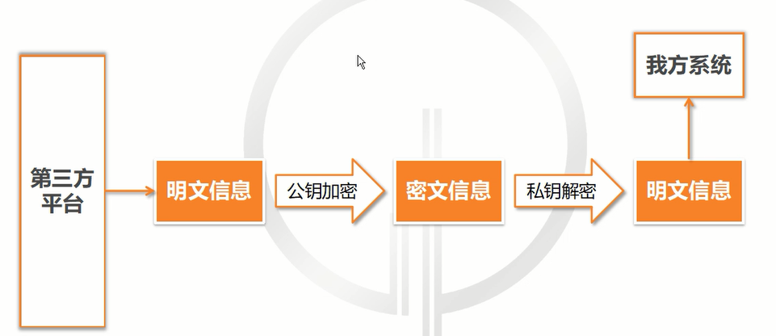
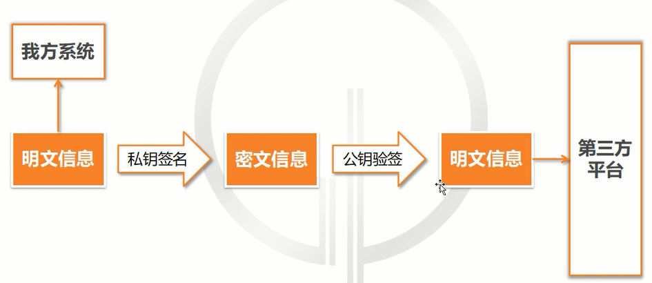
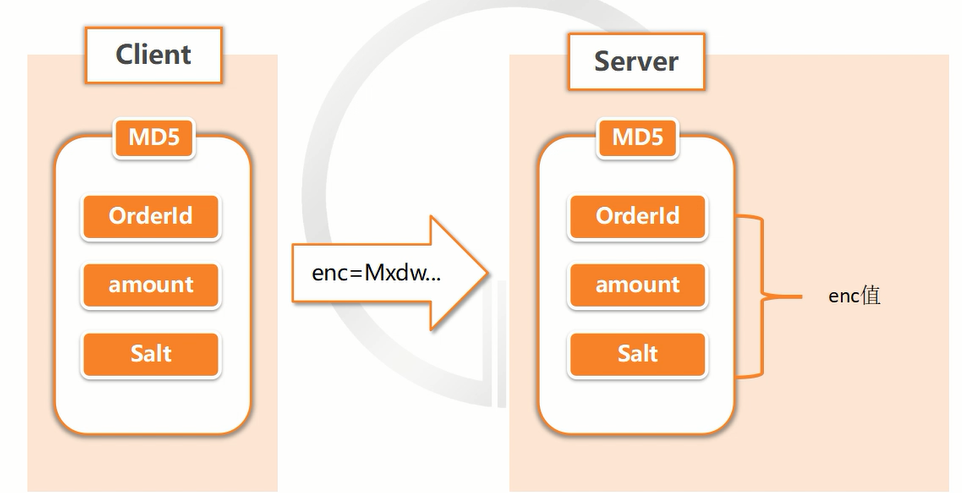

# 接口安全策略

## 为什么要开放API

> 常见的接口：
>
> - 短信接口
> - 付款接口
> - 开放SDK
> - 数据接口

## 开放API存在的安全问题

> 数据安全；身份验证；爬虫；系统安全；调用频率；Oath 鉴权；恶意攻击

> 数据窃取：窃取用户密码信息，获得敏感信息盗刷
>
> 数据篡改：提交的数据被抓包，篡改之后再提交
>
> 数据泄露：爬虫抓取业务数据甚至核心数据，造成直接或间接损失

## 如何让开发的API不再裸奔

### 数据窃取

#### 概念

> 窃取用户的密码信息，获取敏感信息。

> 对称加密（DES）：值不变的情况，每次加密的结果都是一样的

> 非对称加密(RSA)：值不变的情况，每次加密的结果都不一样

#### 解决方案

##### RSA

###### RSA加密

###### RSA签名

### 数据篡改

#### 概念

> 提交的数据被抓包，篡改之后再提交

#### 解决方案

> MD5： 不可逆混淆算法，解决数据篡改

### 数据泄露

#### 概念

> 爬虫业务，造成数据泄露

#### 解决方案

> 令牌：每次请求携带TONKEN，解决数据泄露

