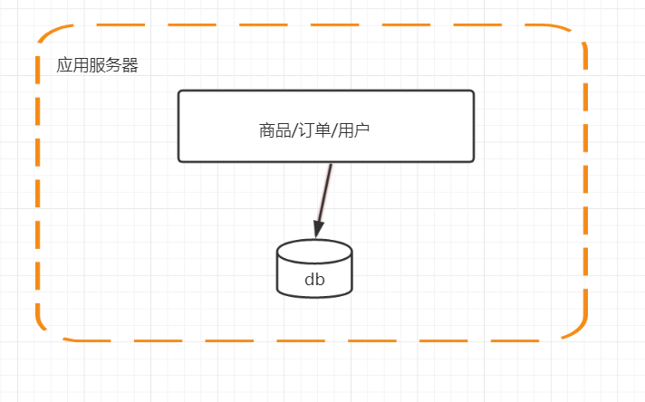
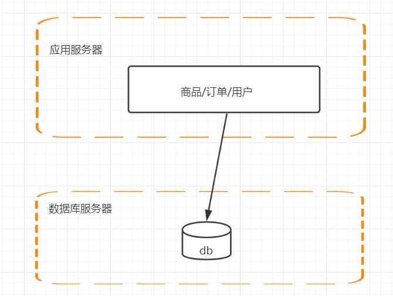
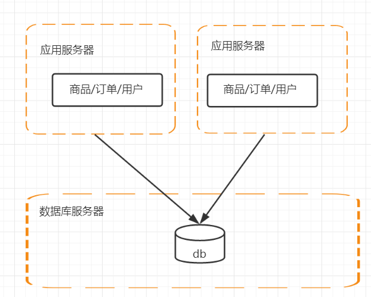
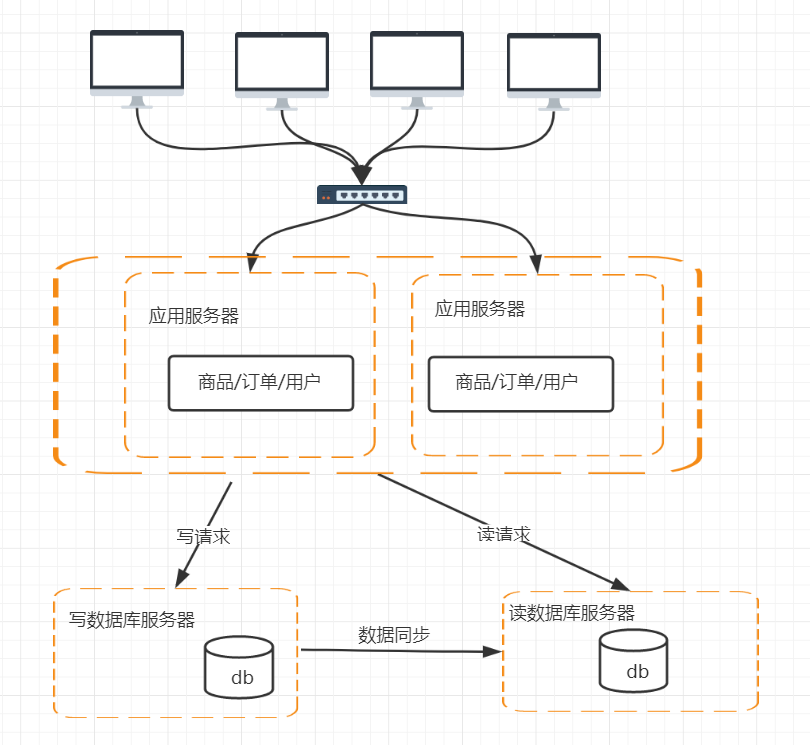
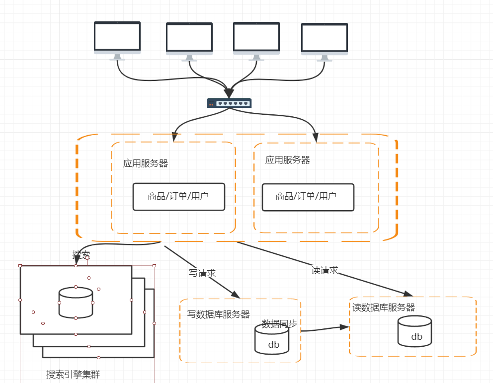
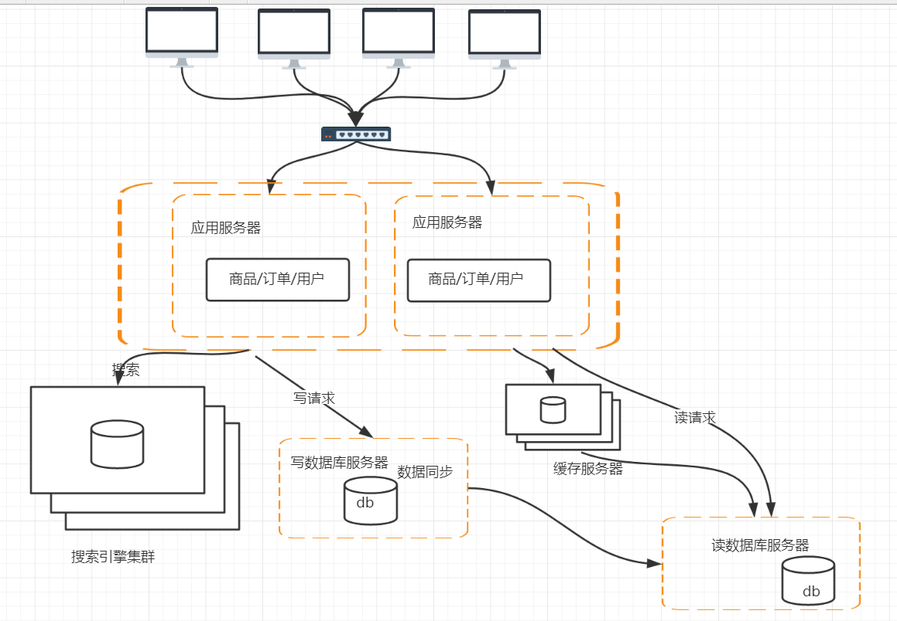
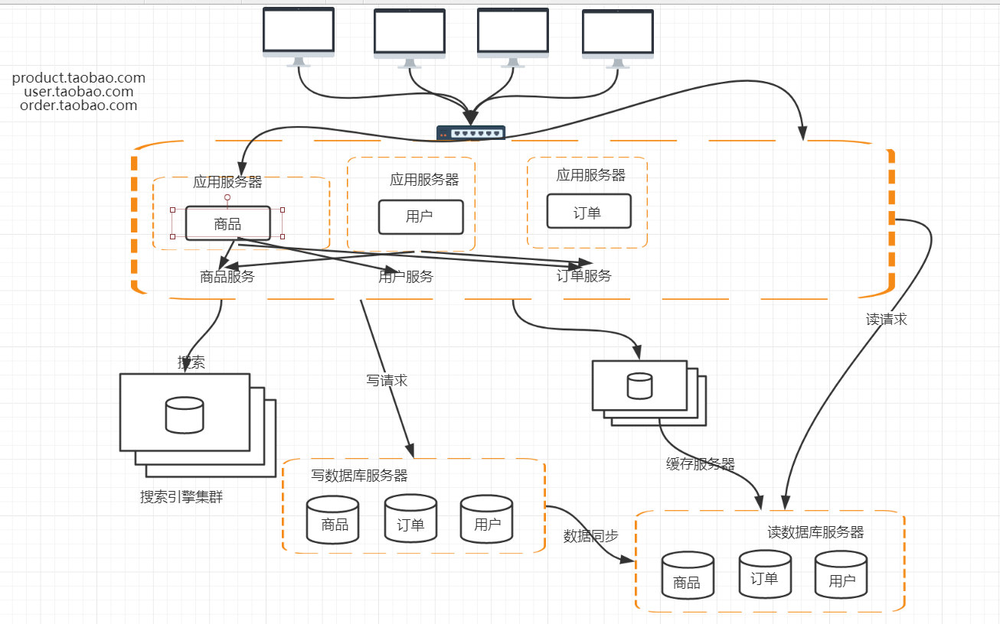

# 分布式要解决的问题

#### 任务分解

>  领域模型

#### 节点通信

> rpc

>  消息中间件

# 分布式和集群

#### 分布式

> 一个业务拆分成多个子系统，部署在不同的服务器上（高性能）

#### 集群  

> 同一个业务，部署在多个服务器上（高可用）

# 什么是大型网站

 访问量（tps、qps）

数据量（存储数据量）

# 分布式系统的演变过程

###  第一版

### 第二版(单击负载越来越高，数据库服务器和应用服务器分离)

### 第三版(应用服务器做集群)

#### 第三版产生的问题

##### session跨域共享

###### session sticky

###### sessionreplication

###### session 集中存储

> 存储在db
>
> 存储在缓存服务器 （redis）

###### cookie (主流)

> JWT

##### 请求的转发

### 第四版(数据库的高性能操作)

#### 第四版产生的问题

##### 数据库读写分离怎么操作

##### 数据库的数据同步

##### 数据库路由 mycat

### 第五版

#### 第五版产生的问题(搜索引擎的增加)

######  实时增量同步

###### 定时全量同步

###   第六版（引入缓存机制）

#### 第六版产生的原因

##### 缓存的实现

##### 限流的实现

##### 降级的实现

### 第七版(数据库的水平/垂直拆分)

#### 第七版产生的问题

##### 数据库的水平拆分

#####  数据库的垂直拆分

### 第八版(应用的拆分)

日志采集  

日志分析

项目监控

