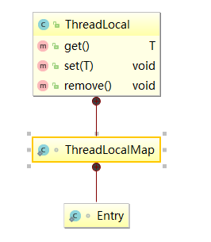
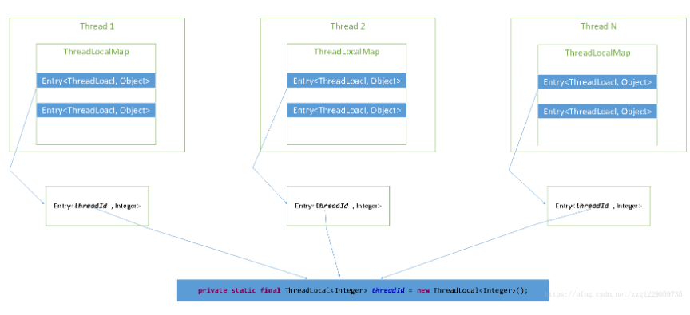
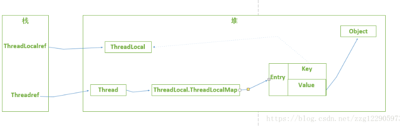
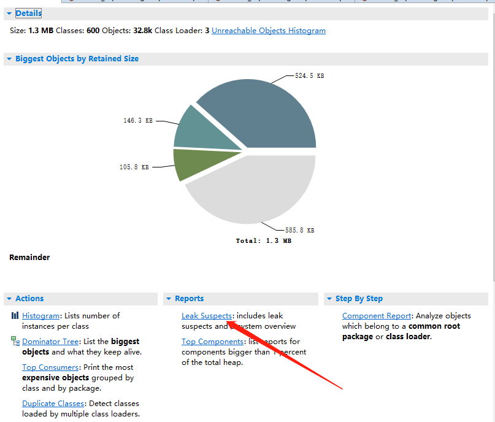
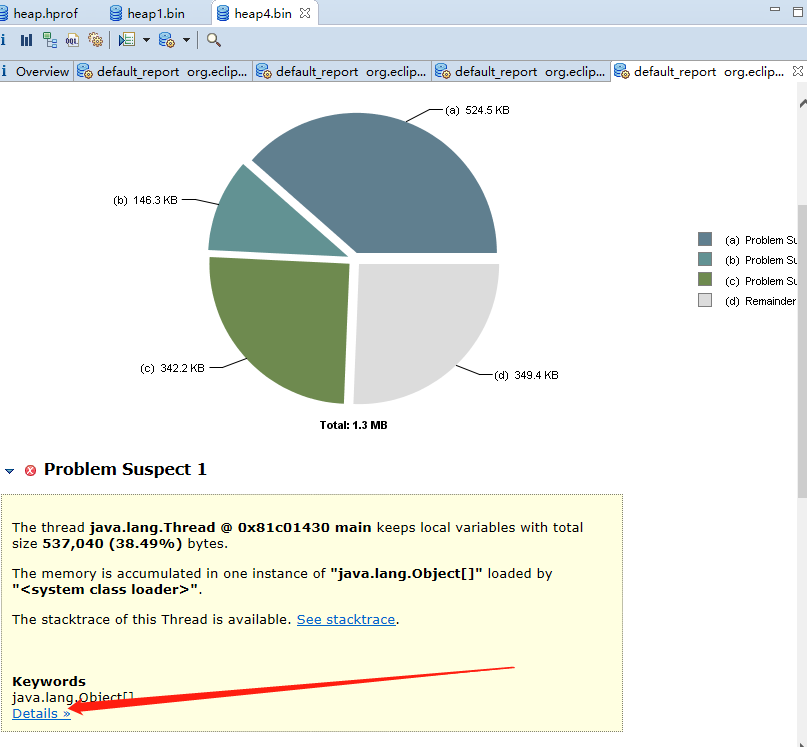
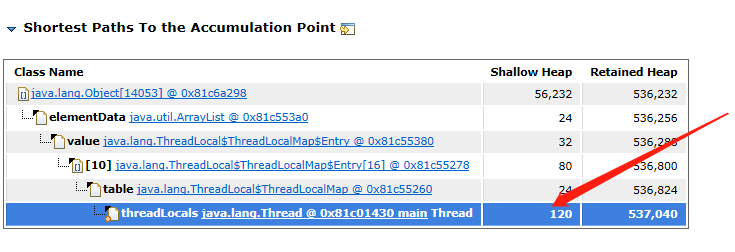

# ThreadLocal

#### 概念

> 我们发现Thread并没有提供成员变量threadLocals的设置与访问的方法，那么每个线程的实例threadLocals参数我们如何操作呢？这时我们的主角：ThreadLocal就登场了。
>
> 所以有那么一句总结：**ThreadLocal是线程Thread中属性threadLocals的管理者**。
>
> 也就是说我们对于ThreadLocal的get, set，remove的操作结果都是针对当前线程Thread实例的threadLocals存，取，删除操作


1.每个人都一张银行卡
2.每个人每张卡都有一定的余额。
3.每个人获取银行卡余额都必须通过该银行的管理系统。
4.每个人都只能获取自己卡持有的余额信息，他人的不可访问。


映射到我们要说的ThreadLocal
1.card类似于Thread
2.card余额属性，卡号属性等类似于Treadlocal内部属性集合threadLocals
3.cardManager类似于ThreadLocal管理类


#### 代码演示

> 见文档 /code/ThreadLocalID.java    /code/ThreadLocalIDClient


#### ThreadLocal原理

##### ThreadLocal类结构及方法解析：



##### ThreadLocal及Thread之间的关系



> 从这张图我们可以直观的看到Thread中属性threadLocals，作为一个特殊的Map，它的key值就是我们`ThreadLocal`实例，而value值这是我们设置的值。


#### ThreadLocal使用有哪些坑及注意事项

我经常在网上看到骇人听闻的标题，ThreadLocal导致内存泄漏，这通常让一些刚开始对ThreadLocal理解不透彻的开发者，不敢贸然使用。越不用，越陌生。这样就让我们错失了更好的实现方案，所以敢于引入新技术，敢于踩坑，才能不断进步。
我们来看下为什么说ThreadLocal会引起内存泄漏，什么场景下会导致内存泄漏？

> 先回顾下什么叫内存泄漏，对应的什么叫内存溢出

> - Memory overflow:内存溢出，没有足够的内存提供申请者使用。

> - Memory leak:内存泄漏，程序申请内存后，无法释放已申请的内存空间，内存泄漏的堆积终将导致内存溢出。

显然是TreadLocal在不规范使用的情况下导致了内存没有释放。

```java
static class Entry extends WeakReference<ThreadLocal<?>> {
            /** The value associated with this ThreadLocal. */
            Object value;

            Entry(ThreadLocal<?> k, Object v) {
                super(k);
                value = v;
            }
        }
```

##### 引用说明

| 类型   | 回收时间                                | 应用场景                                                     |
| ------ | --------------------------------------- | ------------------------------------------------------------ |
| 强引用 | 一直存活，除非GC Roots不可达            | 所有程序的场景，基本对象，自定义对象等                       |
| 软引用 | 内存不足时会被回收                      | 一般用在对内存非常敏感的资源上，用作缓存的场景比较多，例如：网页缓存、图片缓存 |
| 弱引用 | 只能存活到下一次GC前                    | 生命周期很短的对象，例如ThreadLocal中的Key。                 |
| 虚引用 | 随时会被回收， 创建了可能很快就会被回收 | 可能被JVM团队内部用来跟踪JVM的垃圾回收活动                   |
|        |                                         |                                                              |

> 既然`WeakReference`在下一次gc即将被回收，那么我们的程序为什么没有出问题呢？

##### **弱引用**的回收机制

```java
      /**
         * 这一种存在强引用不会被回收
         */
        String s = new String("hello world");

        WeakReference<String> weakReference = new WeakReference<String>(s);

        System.gc();

        if(weakReference == null){
            System.out.println("weakReference被回收");
        }else{
            System.out.println(weakReference.get());
        }
```


```java
/**这里没有强引用将会被回收。*/    
WeakReference<String> weakReference = new WeakReference<String>(new String("hello world"));

        System.gc();

        if(weakReference == null){
            System.out.println("weakReference被回收");
        }else{
            System.out.println(weakReference.get()); //null
        }
```




> 如上图所示，我们在作为key的ThreadLocal对象没有外部强引用，下一次gc必将产生key值为null的数据，若线程没有及时结束必然出现，一条强引用链Threadref–>Thread–>ThreadLocalMap–>Entry，所以这将导致内存泄漏。

##### 模拟内存泄漏

###### 测试代码

> /code/TestThreadLocalLeak.java

###### 导出dump文件

> jmap -dump:live,format=b,file=heap.bin <pid>

###### MAT







以上我们复现了ThreadLocal不正当使用，引起的内存泄漏。demo在这里。
    所以我们总结了使用ThreadLocal时会发生内存泄漏的前提条件：

- ThreadLocal引用被设置为null，且后面没有set，get,remove操作。

- 线程一直运行，不停止。（线程池）

- 触发了垃圾回收。（Minor GC或Full GC）


我们看到ThreadLocal出现内存泄漏条件还是很苛刻的，所以我们只要破坏其中一个条件就可以避免内存泄漏，单但为了更好的避免这种情况的发生我们使用ThreadLocal时遵守以下两个小原则:

- ThreadLocal申明为private static final。
           Private与final 尽可能不让他人修改变更引用，
           Static 表示为类属性，只有在程序结束才会被回收。

- ThreadLocal使用后务必调用remove方法。

​       最简单有效的方法是使用后将其移除。


##### **防止内存泄漏**

> 针对该问题，ThreadLocalMap 的 set 方法中，通过 replaceStaleEntry 方法将所有键为 null 的 Entry 的值设置为 null，从而使得该值可被回收。另外，会在 rehash 方法中通过 expungeStaleEntry 方法将键和值为 null 的 Entry 设置为 null 从而使得该 Entry 可被回收。通过这种方式，ThreadLocal 可防止内存泄漏。

#### 应用场景

> spring中记录请求的执行时间

```java
public class LogInterceptor extends BaseService implements HandlerInterceptor {

	private static final ThreadLocal<Long> startTimeThreadLocal =
			new NamedThreadLocal<Long>("ThreadLocal StartTime");
	
	@Override
	public boolean preHandle(HttpServletRequest request, HttpServletResponse response, 
			Object handler) throws Exception {
		if (logger.isDebugEnabled()){
			long beginTime = System.currentTimeMillis();//1、开始时间  
	        startTimeThreadLocal.set(beginTime);		//线程绑定变量（该数据只有当前请求的线程可见）  
	        logger.debug("开始计时: {}  URI: {}", new SimpleDateFormat("hh:mm:ss.SSS")
	        	.format(beginTime), request.getRequestURI());
		}
		return true;
	}

	@Override
	public void postHandle(HttpServletRequest request, HttpServletResponse response, Object handler, 
			ModelAndView modelAndView) throws Exception {
		if (modelAndView != null){
			logger.info("ViewName: " + modelAndView.getViewName());
		}
	}

	@Override
	public void afterCompletion(HttpServletRequest request, HttpServletResponse response, 
			Object handler, Exception ex) throws Exception {

		// 保存日志
		LogUtils.saveLog(request, handler, ex, null);
		
		// 打印JVM信息。
		if (logger.isDebugEnabled()){
			long beginTime = startTimeThreadLocal.get();//得到线程绑定的局部变量（开始时间）  
			long endTime = System.currentTimeMillis(); 	//2、结束时间  
	        logger.debug("计时结束：{}  耗时：{}  URI: {}  最大内存: {}m  已分配内存: {}m  已分配内存中的剩余空间: {}m  最大可用内存: {}m",
	        		new SimpleDateFormat("hh:mm:ss.SSS").format(endTime), DateUtils.formatDateTime(endTime - beginTime),
					request.getRequestURI(), Runtime.getRuntime().maxMemory()/1024/1024, Runtime.getRuntime().totalMemory()/1024/1024, Runtime.getRuntime().freeMemory()/1024/1024, 
					(Runtime.getRuntime().maxMemory()-Runtime.getRuntime().totalMemory()+Runtime.getRuntime().freeMemory())/1024/1024); 
	        //删除线程变量中的数据，防止内存泄漏
	        startTimeThreadLocal.remove();
		}
		
	}

}
```

