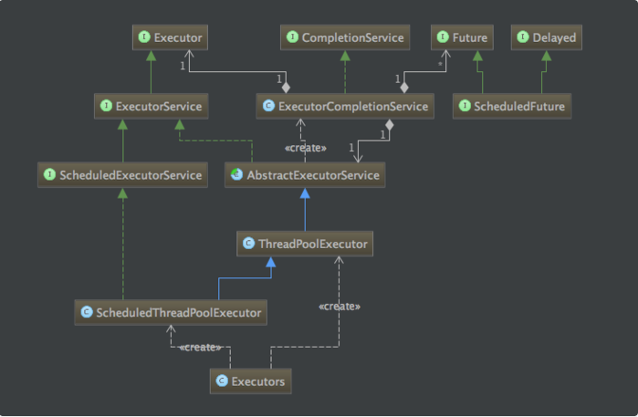
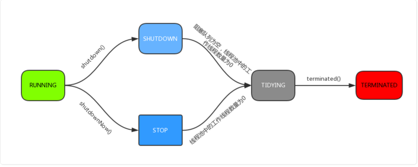

## 线程池介绍

> **概要：降低资源消耗，提高响应速度**

在web开发中，服务器需要接受并处理请求，所以会为一个请求来分配一个线程来进行处理。如果每次请求都新创建一个线程的话实现起来非常简便，但是存在一个问题：

> 如果并发的请求数量非常多，但每个线程执行的时间很短，这样就会频繁的创建和销毁线程，如此一来会大大降低系统的效率。可能出现服务器在为每个请求创建新线程和销毁线程上花费的时间和消耗的系统资源要比处理实际的用户请求的时间和资源更多。

所以线程池就出现了。线程池为线程生命周期的开销和资源不足问题提供了解决方案。通过对多个任务重用线程，线程创建的开销被分摊到了多个任务上。

使用线程池的好处：

- 降低资源消耗。通过重复利用已创建的线程降低线程创建和销毁造成的消耗。
- 提高响应速度。当任务到达时，任务可以不需要等到线程创建就能立即执行。
- 提高线程的可管理性。线程是稀缺资源，如果无限制的创建，不仅会消耗系统资源，还会降低系统的稳定性，使用线程池可以进行统一的分配，调优和监控。

Java中的线程池是用ThreadPoolExecutor类来实现的. 本文就结合JDK 1.8的源码来分析一下这个类内部对于线程的创建, 管理以及后台任务的调度等方面的执行原理。

## 继承关系

我们首先来看一下线程池的类图：



**Executor接口**

```java
public interface Executor {
    /**
     * 在将来的某个时候执行传入的命令，执行命令可以在实现类里通过新创建的线程、线程池、当前线程来完成。
     */
    void execute(Runnable command);
}
```

**ExecutorService接口**

```java
public interface ExecutorService extends Executor {

    /**
     * 启动先前提交的任务被执行的有序关闭，但不接受新的任务。 如果已经关闭，则调用没有其他影响。
     */
    void shutdown();

    /**
     * 尝试停止所有正在执行的任务，停止等待任务的处理，并返回正在等待执行的任务的列表。
     * 该方法不能等待之前提交的任务执行完，如果需要等待执行，可以使用{@link #awaitTermination awaitTermination}
     * 从这个方法返回后，这些任务从任务队列中排出（移除）。 除了竭尽全力地停止处理主动执行任务之外，没有任何保证。 
     */
    List<Runnable> shutdownNow();

    /**
     * 线程池有没有被关闭，关闭返回true，否则false
     */
    boolean isShutdown();

    /**
     * 如果所有任务在关闭后都完成了。返回true
     * 提示：如果没有在调用该方法前调用shutdown或者shutdownNow方法，此方法永远不会返回true
     */
    boolean isTerminated();

    /**
     * 在指定时间内阻塞等待任务全部完成，完成了返回true，否则false
     */
    boolean awaitTermination(long timeout, TimeUnit unit)
        throws InterruptedException;

    /**
     * 提交一个有返回值的任务
     */
    <T> Future<T> submit(Callable<T> task);

    /**
     * 提交一个任务来执行，返回一个有返回值的结果，返回值为传入的result
     */
    <T> Future<T> submit(Runnable task, T result);

    /**
     * 提交一个任务来执行，返回一个有返回值的结果，返回值为null
     */
    Future<?> submit(Runnable task);

    /**
     * 执行一批有返回值的任务
     * 返回的结果调用{@link Future#isDone}都是true
     */
    <T> List<Future<T>> invokeAll(Collection<? extends Callable<T>> tasks)
        throws InterruptedException;
    /**
     * 执行给定的任务，当全部完成或者超时返回一个有状态和结果的Future集合。
     * 返回的结果调用{@link Future#isDone}都是true
     * 返回时，尚未完成的任务将被取消。
     * 如果在进行此操作时修改了给定的集合，则此方法的结果是不确定的。
     */
    <T> List<Future<T>> invokeAll(Collection<? extends Callable<T>> tasks,
                                  long timeout, TimeUnit unit)
        throws InterruptedException;

    /**
     * 执行给定的任务，返回一个成功完成任务的结果（即，没有抛出异常），
     * 如果有的话。 在正常或异常返回时，尚未完成的任务将被取消。 
     * 如果在进行此操作时修改了给定的集合，则此方法的结果是不确定的。
     */
    <T> T invokeAny(Collection<? extends Callable<T>> tasks)
        throws InterruptedException, ExecutionException;

    /**
     * 执行给定的任务，返回一个成功完成任务的结果（即，没有抛出异常），
     * 如果有的话。 在正常或异常返回时，尚未完成的任务将被取消。 
     * 如果在进行此操作时修改了给定的集合，则此方法的结果是不确定的。
     * 超时没有成功结果抛出TimeoutException
     */
    <T> T invokeAny(Collection<? extends Callable<T>> tasks,
                    long timeout, TimeUnit unit)
        throws InterruptedException, ExecutionException, TimeoutException;
}
```

**AbstractExecutorService接口**

```java
protected <T> RunnableFuture<T> newTaskFor(Runnable runnable, T value) {
    return new FutureTask<T>(runnable, value);
}

protected <T> RunnableFuture<T> newTaskFor(Callable<T> callable) {
    return new FutureTask<T>(callable);
}

private <T> T doInvokeAny(Collection<? extends Callable<T>> tasks,
                          boolean timed, long nanos)
    throws InterruptedException, ExecutionException, TimeoutException {
    // ...
}
```

## ThreadPoolExecutor分析

想要深入理解ThreadPoolExecutor，就要先理解其中最重要的几个参数：

### 核心变量与方法（状态转换）

```java
// 状态|工作数的一个32bit的值
private final AtomicInteger ctl = new AtomicInteger(ctlOf(RUNNING, 0));
private static final int COUNT_BITS = Integer.SIZE - 3;
// 0001-1111-1111-1111-1111-1111-1111-1111
private static final int CAPACITY   = (1 << COUNT_BITS) - 1;

// 1110-0000-0000-0000-0000-0000-0000-0000
private static final int RUNNING    = -1 << COUNT_BITS;
// 0000-0000-0000-0000-0000-0000-0000-0000
private static final int SHUTDOWN   =  0 << COUNT_BITS;
// 0010-0000-0000-0000-0000-0000-0000-0000
private static final int STOP       =  1 << COUNT_BITS;
// 0100-0000-0000-0000-0000-0000-0000-0000
private static final int TIDYING    =  2 << COUNT_BITS;
// 0110-0000-0000-0000-0000-0000-0000-0000
private static final int TERMINATED =  3 << COUNT_BITS;

// ~CAPACITY就是前3位状态位，和c进行&就能得到当前的状态
private static int runStateOf(int c)     { return c & ~CAPACITY; }
// 和c进行&就能得到当前的工作数
private static int workerCountOf(int c)  { return c & CAPACITY; }
// rs就是状态值，wc就是工作数，这两个进行或操作，就能得到ctl的值（32bit的值）
private static int ctlOf(int rs, int wc) { return rs | wc; }
```

可能很多人看到上面的写法都蒙圈了。我其实基础也不太好，所以我看到这里的时候索性写了个工具类去测试他们的输出结果，如下：

```java
public class ExecutorTest {
    private final static int COUNT_BITS = Integer.SIZE - 3;
    private final static int RUNNING    = -1 << COUNT_BITS;
    private final static int SHUTDOWN   =  0 << COUNT_BITS;
    private final static int STOP       =  1 << COUNT_BITS;
    private final static int TIDYING    =  2 << COUNT_BITS;
    private final static int TERMINATED =  3 << COUNT_BITS;
    private final static int CAPACITY   = (1 << COUNT_BITS) - 1;

    public static void main(String[] args) {
        System.out.println("状态位===");
        System.out.println(getFormatStr(RUNNING));
        System.out.println(getFormatStr(SHUTDOWN));
        System.out.println(getFormatStr(STOP));
        System.out.println(getFormatStr(TIDYING));
        System.out.println(getFormatStr(TERMINATED));
        System.out.println(getFormatStr(CAPACITY));
    }

    private static String getFormatStr(int n) {
        String integerMaxValueStr = Integer.toBinaryString(n);
        int a = 32;
        StringBuilder sb = new StringBuilder();
        int l = integerMaxValueStr.length();
        int i = 0;
        for (; a > 0; --a) {
            if (--l >= 0) {
                sb.append(integerMaxValueStr.charAt(l));
            } else {
                sb.append("0");
            }
            if (++i % 4 == 0) {
                if (a > 1) {
                    sb.append("-");
                }
                i = 0;
            }
        }
        return sb.reverse().toString();
    }
}
```

输出结果为：

```java
状态位===
1110-0000-0000-0000-0000-0000-0000-0000
0000-0000-0000-0000-0000-0000-0000-0000
0010-0000-0000-0000-0000-0000-0000-0000
0100-0000-0000-0000-0000-0000-0000-0000
0110-0000-0000-0000-0000-0000-0000-0000
0001-1111-1111-1111-1111-1111-1111-1111
```

通过上面的注释以及测试用例可以发现，源码的作者巧妙的运用一个值代表了2种意思（前3bit位是状态，后29bit是工作数），下面我们来看看线程池最重要的5种状态：

1. **RUNNING**：能接受新提交的任务，并且也能处理阻塞队列中的任务；
2. **SHUTDOWN**：关闭状态，不再接受新提交的任务，但却可以继续处理阻塞队列中已保存的任务。在线程池处于 RUNNING 状态时，调用 shutdown()方法会使线程池进入到该状态。（finalize() 方法在执行过程中也会调用shutdown()方法进入该状态）；
3. **STOP**：不能接受新任务，也不处理队列中的任务，会中断正在处理任务的线程。在线程池处于 RUNNING 或 SHUTDOWN 状态时，调用 shutdownNow() 方法会使线程池进入到该状态；
4. **TIDYING**：如果所有的任务都已终止了，workerCount (有效线程数) 为0，线程池进入该状态后会调用 terminated() 方法进入TERMINATED 状态。
5. **TERMINATED**：在terminated() 方法执行完后进入该状态，默认terminated()方法中什么也没有做。

下图为线程池的状态转换过程：



### 构造方法

```java
/**
 * @param corePoolSize 保留在线程池中的线程数，即使它们处于空闲状态，除非设置了{@code allowCoreThreadTimeOut}
 * @param maximumPoolSize 线程池中允许的最大线程数
 * @param keepAliveTime 当线程数大于corePoolSize时，这是多余空闲线程在终止之前等待新任务的最大时间。
 * @param unit {@code keepAliveTime}参数的时间单位
 * @param workQueue 在执行任务之前用于保存任务的队列。 这个队列将只保存{@code execute}方法提交的{@code Runnable}任务。
 * @param threadFactory 用来执行的时候创建线程的线程工厂
 * @param handler 在执行被阻塞时使用的处理程序，因为达到了线程边界和队列容量
 */
public ThreadPoolExecutor(int corePoolSize,
                          int maximumPoolSize,
                          long keepAliveTime,
                          TimeUnit unit,
                          BlockingQueue<Runnable> workQueue,
                          ThreadFactory threadFactory,
                          RejectedExecutionHandler handler) {
    if (corePoolSize < 0 ||
        maximumPoolSize <= 0 ||
        maximumPoolSize < corePoolSize ||
        keepAliveTime < 0)
        throw new IllegalArgumentException();
    if (workQueue == null || threadFactory == null || handler == null)
        throw new NullPointerException();
    this.corePoolSize = corePoolSize;
    this.maximumPoolSize = maximumPoolSize;
    this.workQueue = workQueue;
    this.keepAliveTime = unit.toNanos(keepAliveTime);
    this.threadFactory = threadFactory;
    this.handler = handler;
}
```

对于参数handler：线程池提供了4种策略：

1. **AbortPolicy**：直接抛出异常，这是默认策略。
2. **CallerRunsPolicy**：用调用者所在的线程来执行任务。
3. **DiscardOldestPolicy**：丢弃阻塞队列中靠最前的任务，并执行当前任务。
4. **DiscardPolicy**：直接丢弃任务。

### 核心方法

**execute方法**

线程池最核心的方法莫过于execute了，execute()方法用来提交任务，下面我们顺着这个方法看看其实现原理：

```java
/**
 * 在未来的某个时刻执行给定的任务。这个任务用一个新线程执行，或者用一个线程池中已经存在的线程执行
 * 如果任务无法被提交执行，要么是因为这个Executor已经被shutdown关闭，要么是已经达到其容量上限，任务会被当前的RejectedExecutionHandler处理
 */
public void execute(Runnable command) {
    if (command == null)
        throw new NullPointerException();
    /*
     * 执行分以下3步：
     *
     * 1. 如果运行的线程少于corePoolSize，尝试开启一个新线程去运行command，command作为这个线程的第一个任务
     *
     * 2. 如果线程入队成功，然后还是要进行double-check的，因为线程池在入队之后状态是可能会发生变化的
     *
     * 3. 如果无法将任务入队列（可能队列满了），需要新开一个线程
     * 如果失败了，说明线程池shutdown 或者 饱和了，所以我们拒绝任务。
     */
    int c = ctl.get();

    /**
     * 1、如果当前线程数少于corePoolSize，开启一个线程执行命令
     *（可能是由于addWorker()操作已经包含对线程池状态的判断，如此处没加，而入workQueue前加了）
     */
    if (workerCountOf(c) < corePoolSize) {
        if (addWorker(command, true))
            return;

        /**
         * 没有成功addWorker()，再次获取c（凡是需要再次用ctl做判断时，都会再次调用ctl.get()）
         * 失败的原因可能是：
         * 1、线程池已经shutdown，shutdown的线程池不再接收新任务
         * 2、workerCountOf(c) < corePoolSize 判断后，由于并发，别的线程先创建了worker线程，导致workerCount>=corePoolSize
         */
        c = ctl.get();
    }

    /**
     * 2、如果线程池RUNNING状态，且入队列成功
     */
    if (isRunning(c) && workQueue.offer(command)) {
        int recheck = ctl.get();//再次校验位

        //如果再次校验过程中，线程池不是RUNNING状态，并且remove(command)--workQueue.remove()成功，拒绝当前command
        if (! isRunning(recheck) && remove(command))
            reject(command);
        else if (workerCountOf(recheck) == 0)
            // 新建一个worker线程，没有指定firstTask，因为命令已经放入queue里了
            addWorker(null, false);
    }
    /**
     * 3、如果线程池不是running状态 或者 无法入队列
     *   尝试开启新线程，扩容至maxPoolSize，如果addWork(command, false)失败了，拒绝当前command
     */
    else if (!addWorker(command, false))
        reject(command);
}
```

在执行execute()方法时如果状态一直是RUNNING时，的执行过程如下：

1. 如果workerCount < corePoolSize，则创建并启动一个线程来执行新提交的任务。
2. 如果workerCount >= corePoolSize，且线程池内的阻塞队列未满，则将任务添加到该阻塞队列中。
3. 如果workerCount >= corePoolSize && workerCount < maximumPoolSize，且线程池内的阻塞队列已满，则创建并启动一个线程来执行新提交的任务。
4. 如果workerCount >= maximumPoolSize，并且线程池内的阻塞队列已满, 则根据拒绝策略来处理该任务, 默认的处理方式是直接抛异常。

