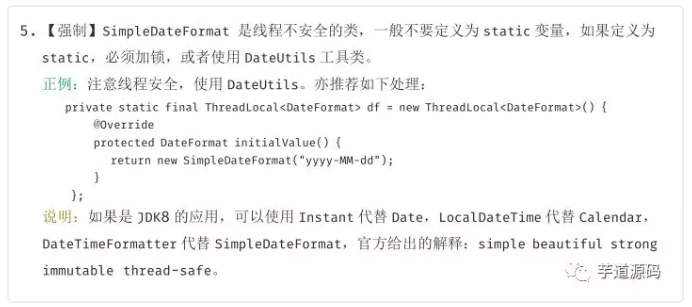

## 代码演示

> 原文地址：https://mp.weixin.qq.com/s/YmmM1KdGX_g46Sn_vFQraA

日常开发中，我们经常需要使用时间相关类，说到时间相关类，想必大家对SimpleDateFormat并不陌生。主要是用它进行时间的格式化输出和解析，挺方便快捷的，但是SimpleDateFormat并不是一个线程安全的类。在多线程情况下，会出现异常，想必有经验的小伙伴也遇到过。下面我们就来分析分析SimpleDateFormat为什么不安全？是怎么引发的？以及多线程下有那些SimpleDateFormat的解决方案？

先看看《阿里巴巴开发手册》对于SimpleDateFormat是怎么看待的：



一般我们使用SimpleDateFormat的时候会把它定义为一个静态变量，避免频繁创建它的对象实例，如下代码：

```java
public class SimpleDateFormatTest {

    private static final SimpleDateFormat sdf = new SimpleDateFormat("yyyy-MM-dd HH:mm:ss");

    public static String formatDate(Date date) throws ParseException {
        synchronized (sdf){
            return sdf.format(date);
        }
    }

    public static Date parse(String strDate) throws ParseException {
        synchronized (sdf){
            return sdf.parse(strDate);
        }
    }

    public static void main(String[] args) throws InterruptedException, ParseException {

        ExecutorService service = Executors.newFixedThreadPool(100);

        for (int i = 0; i < 20; i++) {
            service.execute(() -> {
                for (int j = 0; j < 10; j++) {
                    try {
                        System.out.println(parse("2018-01-02 09:45:59"));
                    } catch (ParseException e) {
                        e.printStackTrace();
                    }
                }
            });
        }
        // 等待上述的线程执行完
        service.shutdown();
        service.awaitTermination(1, TimeUnit.DAYS);

    }

```

> 部分线程获取的时间不对，部分线程直接报`java.lang.NumberFormatException: multiple points`错，线程直接挂死了。


## 多线程不安全原因

因为我们吧SimpleDateFormat定义为静态变量，那么多线程下SimpleDateFormat的实例就会被多个线程共享，B线程会读取到A线程的时间，就会出现时间差异和其它各种问题。SimpleDateFormat和它继承的DateFormat类也不是线程安全的

来看看SimpleDateFormat的format()方法的源码

```java
    @Override
    public StringBuffer format(Date date, StringBuffer toAppendTo,
                               FieldPosition pos)
    {
        pos.beginIndex = pos.endIndex = 0;
        return format(date, toAppendTo, pos.getFieldDelegate());
    }

    // Called from Format after creating a FieldDelegate
    private StringBuffer format(Date date, StringBuffer toAppendTo,
                                FieldDelegate delegate) {
        // Convert input date to time field list
        calendar.setTime(date);

        boolean useDateFormatSymbols = useDateFormatSymbols();

        for (int i = 0; i < compiledPattern.length; ) {
            int tag = compiledPattern[i] >>> 8;
            int count = compiledPattern[i++] & 0xff;
            if (count == 255) {
                count = compiledPattern[i++] << 16;
                count |= compiledPattern[i++];
            }

            switch (tag) {
            case TAG_QUOTE_ASCII_CHAR:
                toAppendTo.append((char)count);
                break;

            case TAG_QUOTE_CHARS:
                toAppendTo.append(compiledPattern, i, count);
                i += count;
                break;

            default:
                subFormat(tag, count, delegate, toAppendTo, useDateFormatSymbols);
                break;
            }
        }
        return toAppendTo;
    }
```

> 注意`calendar.setTime(date);`，SimpleDateFormat的format方法实际操作的就是Calendar。
>
> 因为我们声明SimpleDateFormat为static变量，那么它的Calendar变量也就是一个共享变量，可以被多个线程访问。
>
> 假设线程A执行完calendar.setTime(date)，把时间设置成2019-01-02，这时候被挂起，线程B获得CPU执行权。线程B也执行到了calendar.setTime(date)，把时间设置为2019-01-03。线程挂起，线程A继续走，calendar还会被继续使用(subFormat方法)，而这时calendar用的是线程B设置的值了，而这就是引发问题的根源，出现时间不对，线程挂死等等。

其实SimpleDateFormat源码上作者也给过我们提示：

```properties
 * Date formats are not synchronized.
 * It is recommended to create separate format instances for each thread.
 * If multiple threads access a format concurrently, it must be synchronized
 * externally.
```

> 日期格式不同步。
> 建议为每个线程创建单独的格式实例。
> 如果多个线程同时访问一种格式，则必须在外部同步该格式。

## 解决方案 


#### 只在需要的时候创建新实例，不用static修饰


```java
public static String formatDate(Date date) throws ParseException {
    SimpleDateFormat sdf = new SimpleDateFormat("yyyy-MM-dd HH:mm:ss");
    return sdf.format(date);
}

public static Date parse(String strDate) throws ParseException {
    SimpleDateFormat sdf = new SimpleDateFormat("yyyy-MM-dd HH:mm:ss");
    return sdf.parse(strDate);
}
```


> 如上代码，仅在需要用到的地方创建一个新的实例，就没有线程安全问题，不过也加重了创建对象的负担，会频繁地创建和销毁对象，效率较低。

#### synchronized大法好

```java
private static final SimpleDateFormat sdf = new SimpleDateFormat("yyyy-MM-dd HH:mm:ss");

public static String formatDate(Date date) throws ParseException {
    synchronized(sdf){
        return sdf.format(date);
    }
}

public static Date parse(String strDate) throws ParseException {
    synchronized(sdf){
        return sdf.parse(strDate);
    }
}
```


> 简单粗暴，synchronized往上一套也可以解决线程安全问题，缺点自然就是并发量大的时候会对性能有影响，线程阻塞。

#### ThreadLocal

```java
private static ThreadLocal<DateFormat> threadLocal = new ThreadLocal<DateFormat>() {
    @Override
    protected DateFormat initialValue() {
        return new SimpleDateFormat("yyyy-MM-dd HH:mm:ss");
    }
};

public static Date parse(String dateStr) throws ParseException {
    return threadLocal.get().parse(dateStr);
}

public static String format(Date date) {
    return threadLocal.get().format(date);
}
```


> ThreadLocal可以确保每个线程都可以得到单独的一个SimpleDateFormat的对象，那么自然也就不存在竞争问题了。

####  基于JDK1.8的DateTimeFormatter

```JAVA
public class SimpleDateFormatTest {

    private static final DateTimeFormatter formatter = DateTimeFormatter.ofPattern("yyyy-MM-dd HH:mm:ss");

    public static String formatDate2(LocalDateTime date) {
        return formatter.format(date);
    }

    public static LocalDateTime parse2(String dateNow) {
        return LocalDateTime.parse(dateNow, formatter);
    }

```

