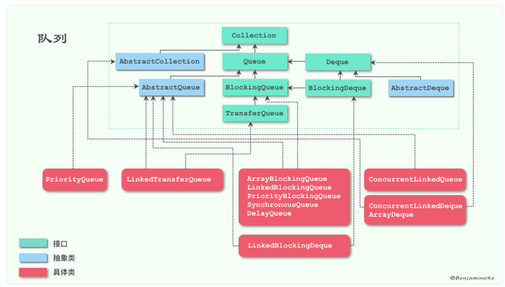

# 简介

> 概要：**队尾  对头    FIFO**  **collection为顶层接口**
>
> http://benjaminwhx.com/2018/05/05/%E8%AF%B4%E8%AF%B4%E9%98%9F%E5%88%97Queue/

Queue（队列）：一种特殊的线性表，它只允许在表的前端（front）进行删除操作，只允许在表的后端（rear）进行插入操作。进行插入操作的端称为队尾，进行删除操作的端称为队头。

每个元素总是从队列的rear端进入队列，然后等待该元素之前的所有元素出队之后，当前元素才能出对，遵循先进先出（FIFO）原则。

图中我们可以看到，最上层是Collection接口，Queue满足集合类的所有方法：

- add(E e)：增加元素；
- remove(Object o)：删除元素；
- clear()：清除集合中所有元素；
- size()：集合元素的大小；
- isEmpty()：集合是否没有元素；
- contains(Object o)：集合是否包含元素o。

# 队列

## Queue

> **概要：增 删 查 各两种方法**

Queue：队列的上层接口，提供了插入、删除、获取元素这3种类型的方法，而且对每一种类型都提供了两种方式，先来看看插入方法：

- add(E e)：插入元素到队尾，插入成功返回true，没有可用空间抛出异常 IllegalStateException。
- offer(E e)： 插入元素到队尾，插入成功返回true，否则返回false。

add和offer作为插入方法的唯一不同就在于队列满了之后的处理方式。add抛出异常，而offer返回false。

再来看看删除和获取元素方法（和插入方法类似）：

- remove()：获取并移除队首的元素，该方法和poll方法的不同之处在于，如果队列为空该方法会抛出异常，而poll不会。
- poll()：获取并移除队首的元素，如果队列为空，返回null。
- element()：获取队列首的元素，该方法和peek方法的不同之处在于，如果队列为空该方法会抛出异常，而peek不会。
- peek()：获取队列首的元素，如果队列为空，返回null。

如果队列是空，remove和element方法会抛出异常，而poll和peek返回null。

当然，Queue只是单向队列，为了提供更强大的功能，JDK在1.6的时候新增了一个双向队列Deque，用来实现更灵活的队列操作。

## Deque

> 

Deque在Queue的基础上，增加了以下几个方法：

- addFirst(E e)：在前端插入元素，异常处理和add一样；
- addLast(E e)：在后端插入元素，和add一样的效果；
- offerFirst(E e)：在前端插入元素，异常处理和offer一样；
- offerLast(E e)：在后端插入元素，和offer一样的效果；
- removeFirst()：移除前端的一个元素，异常处理和remove一样；
- removeLast()：移除后端的一个元素，和remove一样的效果；
- pollFirst()：移除前端的一个元素，和poll一样的效果；
- pollLast()：移除后端的一个元素，异常处理和poll一样；
- getFirst()：获取前端的一个元素，和element一样的效果；
- getLast()：获取后端的一个元素，异常处理和element一样；
- peekFirst()：获取前端的一个元素，和peek一样的效果；
- peekLast()：获取后端的一个元素，异常处理和peek一样；
- removeFirstOccurrence(Object o)：从前端开始移除第一个是o的元素；
- removeLastOccurrence(Object o)：从后端开始移除第一个是o的元素；
- push(E e)：和addFirst一样的效果；
- pop()：和removeFirst一样的效果。

可以发现，其实很多方法的效果都是一样的，只不过名字不同。比如Deque为了实现Stack的语义，定义了push和pop两个方法。

# 阻塞队列

## BlockingQueue

**BlockingQueue（阻塞队列）**，在Queue的基础上实现了阻塞等待的功能。它是JDK 1.5中加入的接口，它是指这样的一个队列：当生产者向队列添加元素但队列已满时，生产者会被阻塞；当消费者从队列移除元素但队列为空时，消费者会被阻塞。

先给出BlockingQueue新增的方法：

- put(E e)：向队尾插入元素。如果队列满了，阻塞等待，直到被中断为止。
- boolean offer(E e, long timeout, TimeUnit unit)：向队尾插入元素。如果队列满了，阻塞等待timeout个时长，如果到了超时时间还没有空间，抛弃该元素。
- take()：获取并移除队首的元素。如果队列为空，阻塞等待，直到被中断为止。
- poll(long timeout, TimeUnit unit)：获取并移除队首的元素。如果队列为空，阻塞等待timeout个时长，如果到了超时时间还没有元素，则返回null。
- remainingCapacity()：返回在无阻塞的理想情况下（不存在内存或资源约束）此队列能接受的元素数量，如果该队列是无界队列，返回Integer.MAX_VALUE。
- drainTo(Collection<? super E> c)：移除此队列中所有可用的元素，并将它们添加到给定 collection 中。
- drainTo(Collection<? super E> c, int maxElements)：最多从此队列中移除给定数量的可用元素，并将这些元素添加到给定 collection 中。

**BlockingQueue**最重要的也就是关于阻塞等待的几个方法，而这几个方法正好可以用来实现**生产-消费的模型**。

从图中我们可以知道实现了BlockingQueue的类有以下几个：

- ArrayBlockingQueue：一个由数组结构组成的有界阻塞队列。
- LinkedBlockingQueue：一个由链表结构组成的有界阻塞队列。
- PriorityBlockingQueue：一个支持优先级排序的无界阻塞队列。
- SynchronousQueue：一个不存储元素的阻塞队列。
- DelayQueue：一个使用优先级队列实现的无界阻塞队列。

### interface-BlockingDeque

#### class-LinkedBlockingDeque

### interface- TransferQueue

#### class-LinkedTransferQueue

### class-ArrayBlockingQueue

### class-LinkedBlockingQueue

### class-PriorityBlockingQueue

### class-SynchronousQueue

### class-DelayQueue