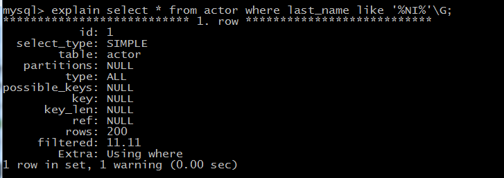
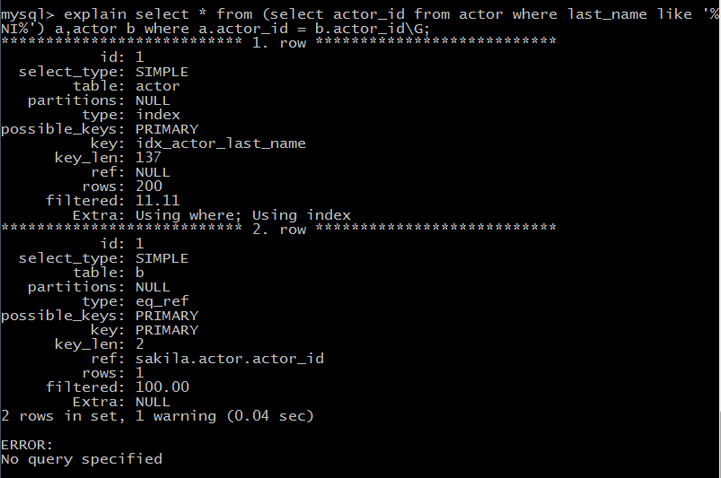

# 以%开头的LIKE查询不能够利用B-tree索引

#### 无法使用索引

```mys
explain select * from actor where last_name like '%NI%'\G;
```





#### 解决办法

**先扫描索引 last_name获取满足条件的%NI%的主键actor_id列表，之后根据主键回表去检索记录，这样访问避开了全表扫描actor表产生的大量IO请求。**


```mysql
explain select * from (select actor_id from actor where last_name like '%NI%') a,actor b where a.actor_id = b.actor_id\G;
```




