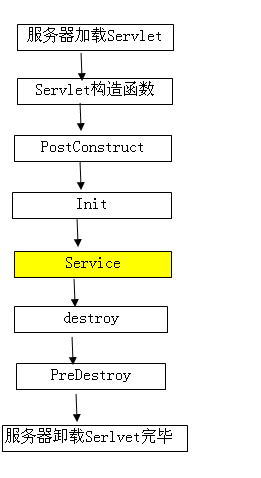

# @PostConstruct @PreDestroy

> 从Java EE 5规范开始，Servlet中增加了两个影响Servlet生命周期的注解（Annotion）
>
> @PostConstruct和@PreDestroy。这两个注解被用来修饰一个非静态的void()方法 。
>
> 写法有如下两种方式：
>
> ```java
> @PostConstruct
> public void someMethod() {
>     
> }
> 
> ```
>
> ```java
> public @PostConstruct void someMethod(){
>     
> }
> ```
>
>  @PostConstruct修饰的方法会在服务器加载Servle的时候运行，并且只会被服务器执行一次。
>
> PostConstruct在构造函数之后执行,init()方法之前执行。
>
> PreDestroy（）方法在destroy()方法执行执行之后执行




>  需要注意的是，注解会多多少少地影响到服务器的启动速度。
>
> 服务器在启动时候会遍历Web 应用的WEB-INF/classes下的所有class文件与WEB-INF/lib下的所有jar文件,以检查哪些类使用了注解。
>
> 如果应用程序中没有 使用任何注解，可以在Web.xml中设置的metadata-complete属性为true.(支持@PostConstruct和 @PreDestroy的服务器需要支持Servlet2.5规范。Tomcat5.x仅支持Servlet2.4规范。)

