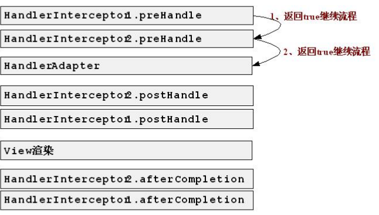
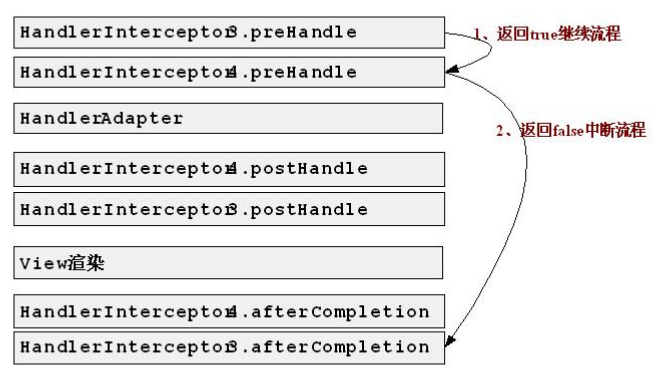

# 处理拦截器(HandlerInterceptor)

#### 拦截器的作用

>  用于对处理器进行预处理和后处理。


#### 拦截器的场景

#####  权限检查

> 如登录检测，进入处理器检测检测是否登录，如果没有直接返回到登录页面；

##### 通用行为

> 读取cookie得到用户信息并将用户对象放入请求，从而方便后续流程使用，还有如提取Locale、Theme
> 信息等，只要是多个处理器都需要的即可使用拦截器实现。

##### 日志记录

> 记录请求信息的日志，以便进行信息监控、信息统计、计算PV（Page View）等。


#### 示例图





> 中断流程中，比如是HandlerInterceptor2中断的流程（preHandle返回false），此处仅调用它之前拦截器的
> preHandle返回true的afterCompletion方法。

#### 拦截器接口

```java
public interface HandlerInterceptor {
    
    
//preHandle：预处理回调方法，实现处理器的预处理（如登录检查)；
//返回值：
//true表示继续流程（如调用下一个拦截器或处理器）；
//false表示流程中断（如登录检查失败），不会继续调用其他的拦截器或处理器，此时我们需要通过response来产生响应；
 default boolean preHandle(HttpServletRequest request, HttpServletResponse response, Object handler)throws Exception {
		return true;
	}

//后处理回调方法，实现处理器的后处理（但在渲染视图之前），此时我们可以通过modelAndView（模型和视图对象）对模型数据进行处理或对视图进行处理，modelAndView也可能为null。
default void postHandle(HttpServletRequest request, HttpServletResponse response, Object handler,@Nullable ModelAndView modelAndView) throws Exception {
	}
    
//整个请求处理完毕回调方法，即在视图渲染完毕时回调，如性能监控中我们可以在此记录结束时间并输出消耗时间，还可以进行一些资源清理，类似于try-catch-finally中的finally，但仅调用处理器执行链中preHandle返回true的拦截器的afterCompletion。
default void afterCompletion(HttpServletRequest request, HttpServletResponse response, Object handler,@Nullable Exception ex) throws Exception {
	}

}
```

#### 拦截器适配器

> 有时候我们可能只需要实现三个回调方法中的某一个，如果实现HandlerInterceptor接口的话，三个方法必须实现，不管你需不需要，此时spring提供了一个HandlerInterceptorAdapter适配器（一种适配器设计模式的实现），允许我们只实现需要的回调方法。

```java
public abstract class HandlerInterceptorAdapter implements HandlerInterceptor {
//省略代码 此处所以三个回调方法都是空实现，preHandle返回true。
}
```

#### DispatcherServlet中拦截器分析

> 将hanlder 与 HandlerInterceptor 封装成为 HandlerExecutionChain

```java
//doDispatch方法

//1、处理器拦截器的预处理（正序执行）
HandlerInterceptor[] interceptors = mappedHandler.getInterceptors();
if (interceptors != null) {
for (int i = 0; i < interceptors.length; i++) {
HandlerInterceptor interceptor = interceptors[i];
if (!interceptor.preHandle(processedRequest, response, mappedHandler.getHandler())) {
//1.1、失败时触发afterCompletion的调用
triggerAfterCompletion(mappedHandler, interceptorIndex, processedRequest, response, null);
return;
}
interceptorIndex = i;//1.2、记录当前预处理成功的索引
}
    

//2、处理器适配器调用我们的处理器
mv = ha.handle(processedRequest, response, mappedHandler.getHandler());
    

//当我们返回null或没有返回逻辑视图名时的默认视图名翻译（RequestToViewNameTranslator）
if (mv != null && !mv.hasView()) {
mv.setViewName(getDefaultViewName(request));
}
    
//3、处理器拦截器的后处理（逆序）
if (interceptors != null) {
for (int i = interceptors.length - 1; i >= 0; i--) {
HandlerInterceptor interceptor = interceptors[i];
interceptor.postHandle(processedRequest, response, mappedHandler.getHandler(), mv);
}
}
    
//4、视图的渲染
if (mv != null && !mv.wasCleared()) {
render(mv, processedRequest, response);
if (errorView) {
WebUtils.clearErrorRequestAttributes(request);
}
    
//5、触发整个请求处理完毕回调方法afterCompletion
triggerAfterCompletion(mappedHandler, interceptorIndex, processedRequest, response, null);
    
```

#### 实践

##### spring 

```java
public class HandlerInterceptor1 extends HandlerInterceptorAdapter {//此处一般继承HandlerInterceptorAdapter适配器即可
@Override
public boolean preHandle(HttpServletRequest request, HttpServletResponse response, Object handler) throws Exception {
System.out.println("===========HandlerInterceptor1 preHandle");
return true;
}
@Override

public void postHandle(HttpServletRequest request, HttpServletResponse response, Object handler, ModelAndView modelAndView) throws Exception {
System.out.println("===========HandlerInterceptor1 postHandle");
}
@Override
public void afterCompletion(HttpServletRequest request, HttpServletResponse response, Object handler, Exception ex) throws Exception {
System.out.println("===========HandlerInterceptor1 afterCompletion");
}
}


```

```xml
<bean id="handlerInterceptor1"class="XXXX.XXXXX.XXXXXXXXX.HandlerInterceptor1"/>

<bean class="org.springframework.web.servlet.handler.BeanNameUrlHandlerMapping">
	<property name="interceptors">
		<list>
			<ref bean="handlerInterceptor1"/>
			<ref bean="handlerInterceptor2"/>
		</list>
	</property>
</bean>
```


##### spring boot

```java
@Configuration
public class MyMvcConfig extends WebMvcConfigurerAdapter {
        @Override
    public void addInterceptors(InterceptorRegistry registry) {
       registry.addInterceptor(new LoginInteceptor())
                .addPathPatterns("/**")
       super.addInterceptors(registry);
    }

}
```

```java
@Component
public class LoginInteceptor implements HandlerInterceptor {
    
}
```

#### 应用

##### 性能监控

> 如记录一下请求的处理时间，得到一些慢请求（如处理时间超过500毫秒），从而进行性能改进，一般的反向代理服务器如apache都具有这个功能，但此处我们演示一下使用拦截器怎么实现。
>
> 
>
> 实现分析：
> 1、在进入处理器之前记录开始时间，即在拦截器的preHandle记录开始时间；
> 2、在结束请求处理之后记录结束时间，即在拦截器的afterCompletion记录结束实现，并用结束时间-开始时间得到这次请求的处理时间。
>
> 
>
> 问题：
> 我们的拦截器是单例，因此不管用户请求多少次都只有一个拦截器实现，即线程不安全，那我们应该怎么记录时间呢？
> 解决方案是使用ThreadLocal，它是线程绑定的变量，提供线程局部变量（一个线程一个ThreadLocal，A线程的ThreadLocal只能看到A线程的ThreadLocal，不能看到B线程的ThreadLocal）

> NamedThreadLocal：Spring提供的一个命名的ThreadLocal实现。
>
> 在测试时需要把stopWatchHandlerInterceptor放在拦截器链的第一个，这样得到的时间才是比较准确的。

```java

public class StopWatchHandlerInterceptor implements HandlerInterceptor {

    private NamedThreadLocal<Long> namedThreadLocal = new NamedThreadLocal<Long>("execute-time");

    public boolean preHandle(HttpServletRequest request, HttpServletResponse response, Object handler)
            throws Exception {

        Long start = System.currentTimeMillis();
        namedThreadLocal.set(start);
        return true;
    }


    public void afterCompletion(HttpServletRequest request, HttpServletResponse response, Object handler,
                                 @Nullable Exception ex) throws Exception {

        long end  = System.currentTimeMillis();
        long start = namedThreadLocal.get();
        if(end-start>500){
            System.out.println("uri---- "+request.getRequestURI()+"  执行时间--- "+String.valueOf(end-start));
        }

    }
}
```

##### 登录检测


