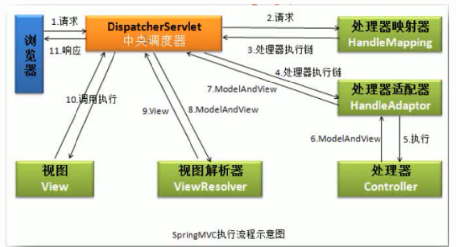

# springmvc执行流程


## 示意图




> 这幅图时网上的down, 而且我在网上不止一次看到过类似的图，然而看了忘，忘了再看。感觉很复杂，一会跳到handlerMapping, 一会又执行到DispatcherServlet。艹反正记不住。今天我跟着代码再看这幅图的时候，顿时感觉如此的简单。你的关注点只在DispatcherServlet即可。没必要跟着处理逻辑跳来跳去。还有一点看代码记住观其大意即可，只有看懂大概，才有必要研究细节。

#### DispatcherServlet#doDispatch

> 上面的流程图中的所有处理过程，在doDispatch在都有体现。

```java

/**
 DispatcherServlet#doDispatch
*/
protected void doDispatch(HttpServletRequest request, HttpServletResponse response) throws Exception {
    	HandlerExecutionChain mappedHandler = null;
        ModelAndView mv = null;
        //这个就是第三步返回处理器链，网上的解释是：交给HandlerMapping,然后交回DispatcherServlet，以前真的不理解。白话文解释：调用getHandler返回一个HandlerExecutionChain
        mappedHandler 
            //这个就是第二步 处理映射器
            = getHandler(processedRequest);
        //第四步
    	HandlerAdapter ha = getHandlerAdapter(mappedHandler.getHandler());
    
       //第七步
       mv = ha.handle(processedRequest, response, mappedHandler.getHandler());
    processDispatchResult(processedRequest, response, mappedHandler, mv, dispatchException);

}


/**
 DispatcherServlet#processDispatchResult
*/
private void processDispatchResult(HttpServletRequest request, HttpServletResponse response,
			@Nullable HandlerExecutionChain mappedHandler, @Nullable ModelAndView mv,
                                   @Nullable Exception exception) throws Exception {
    
    render(mv, request, response);
}


/**
 DispatcherServlet#render
*/

protected void render(ModelAndView mv, HttpServletRequest request, HttpServletResponse response) throws Exception {
   View view;
  view = resolveViewName(viewName, mv.getModelInternal(), locale, request);    
    
    //第十步 完成
    view.render(mv.getModelInternal(), request, response);
    }

/**
 DispatcherServlet#resolveViewName
*/
	@Nullable
	protected View resolveViewName(String viewName, @Nullable Map<String, Object> model,
			Locale locale, HttpServletRequest request) throws Exception {
		if (this.viewResolvers != null) {
			for (ViewResolver viewResolver : this.viewResolvers) {
                 //这个第九步返回View
				View view 
                    //这是第八步
                    = viewResolver.resolveViewName(viewName, locale);
				if (view != null) {
					return view;
				}
			}
		}
		return null;
	}

```


