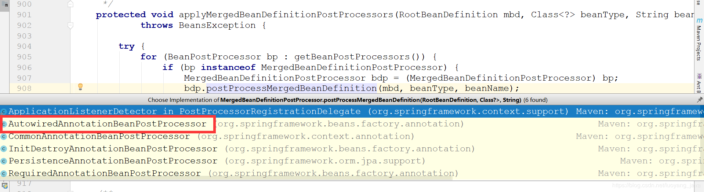
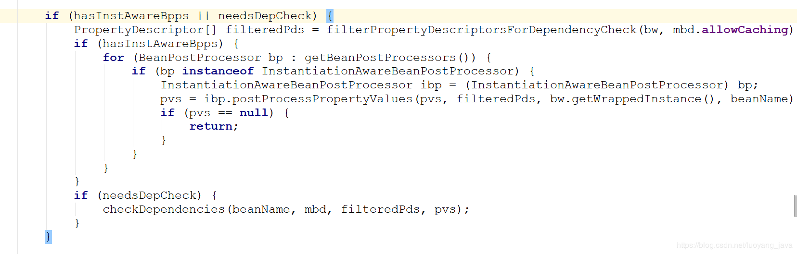
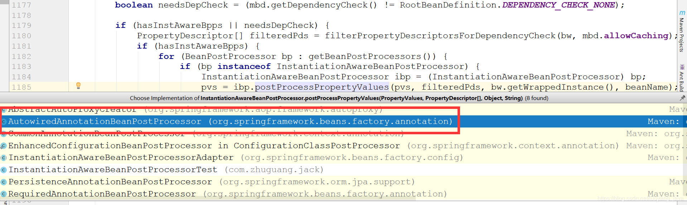
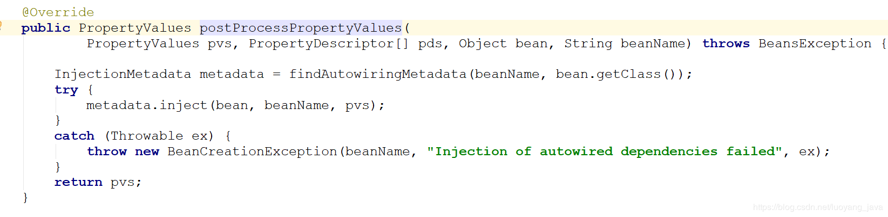

# AutowiredAnnotationBeanPostProcessor

> 解析扫描类里面的@Autowired和@Value @Inject

#### 继承关系

```java
public class AutowiredAnnotationBeanPostProcessor extends InstantiationAwareBeanPostProcessorAdapter
		implements MergedBeanDefinitionPostProcessor, PriorityOrdered, BeanFactoryAware 
```

#### MergedBeanDefinitionPostProcessor

````java
	void postProcessMergedBeanDefinition(RootBeanDefinition beanDefinition, Class<?> beanType, String beanName);

````

#### 调用的地方

##### AbstractAutowireCapableBeanFactory

###### doCreateBean

````java
	protected Object doCreateBean(final String beanName, final RootBeanDefinition mbd, final Object[] args) {

		// Allow post-processors to modify the merged bean definition.
		synchronized (mbd.postProcessingLock) {
			if (!mbd.postProcessed) {
				applyMergedBeanDefinitionPostProcessors(mbd, beanType, beanName);
				mbd.postProcessed = true;
			}
		}


	}

````


###### applyMergedBeanDefinitionPostProcessors

```java
	protected void applyMergedBeanDefinitionPostProcessors(RootBeanDefinition mbd, Class<?> beanType, String beanName)
			throws BeansException {

		try {
			for (BeanPostProcessor bp : getBeanPostProcessors()) {
				if (bp instanceof MergedBeanDefinitionPostProcessor) {
					MergedBeanDefinitionPostProcessor bdp = (MergedBeanDefinitionPostProcessor) bp;
					bdp.postProcessMergedBeanDefinition(mbd, beanType, beanName);
				}
			}
		}
```




#### 源码分析


##### AutowiredAnnotationBeanPostProcessor

##### 构造方法

>  构造函数中把@Autowired和@Value,@Inject的注解加入到了autowiredAnnotationTypes集合中：

```java
	public AutowiredAnnotationBeanPostProcessor() {
		this.autowiredAnnotationTypes.add(Autowired.class);
		this.autowiredAnnotationTypes.add(Value.class);
		try {
			this.autowiredAnnotationTypes.add((Class<? extends Annotation>)
					ClassUtils.forName("javax.inject.Inject", AutowiredAnnotationBeanPostProcessor.class.getClassLoader()));
			logger.info("JSR-330 'javax.inject.Inject' annotation found and supported for autowiring");
		}
		catch (ClassNotFoundException ex) {
			// JSR-330 API not available - simply skip.
		}
	}
```

##### postProcessMergedBeanDefinition

 AutowiredAnnotationBeanPostProcessor类把正在被spring实例化的bean进行@Autowired和@Value扫描，扫描到类里面属性和方法上面如果有注解，就会把对应的方法或者属性封装起来，最终封装成InjectionMetadata对象。

```java
	public void postProcessMergedBeanDefinition(RootBeanDefinition beanDefinition, Class<?> beanType, String beanName) {
		if (beanType != null) {
			InjectionMetadata metadata = findAutowiringMetadata(beanName, beanType);
			metadata.checkConfigMembers(beanDefinition);
		}
	}
```

##### findAutowiringMetadata

```java

	private InjectionMetadata findAutowiringMetadata(String beanName, Class<?> clazz) {

		metadata = buildAutowiringMetadata(clazz);
	
		return metadata;
	}
```

##### buildAutowiringMetadata

###### findAutowiredAnnotation 查看是否有value autowire的注解

###### 字段封装成AutowiredFieldElement 加入currElements集合

###### 方法封装成AutowiredMethodElement加入currElements集合

###### 将目标类，currElements集合封装成InjectionMetadata

```java
private InjectionMetadata buildAutowiringMetadata(Class<?> clazz) {
		LinkedList<InjectionMetadata.InjectedElement> elements = new LinkedList<InjectionMetadata.InjectedElement>();
		Class<?> targetClass = clazz;

		do {
			LinkedList<InjectionMetadata.InjectedElement> currElements = new LinkedList<InjectionMetadata.InjectedElement>();
			for (Field field : targetClass.getDeclaredFields()) {
				Annotation annotation = findAutowiredAnnotation(field);
				if (annotation != null) {
					if (Modifier.isStatic(field.getModifiers())) {
						if (logger.isWarnEnabled()) {
							logger.warn("Autowired annotation is not supported on static fields: " + field);
						}
						continue;
					}
					boolean required = determineRequiredStatus(annotation);
                    //
					currElements.add(new AutowiredFieldElement(field, required));
				}
			}
			for (Method method : targetClass.getDeclaredMethods()) {
				Method bridgedMethod = BridgeMethodResolver.findBridgedMethod(method);
				Annotation annotation = BridgeMethodResolver.isVisibilityBridgeMethodPair(method, bridgedMethod) ?
						findAutowiredAnnotation(bridgedMethod) : findAutowiredAnnotation(method);
				if (annotation != null && method.equals(ClassUtils.getMostSpecificMethod(method, clazz))) {
					if (Modifier.isStatic(method.getModifiers())) {
						if (logger.isWarnEnabled()) {
							logger.warn("Autowired annotation is not supported on static methods: " + method);
						}
						continue;
					}
					if (method.getParameterTypes().length == 0) {
						if (logger.isWarnEnabled()) {
							logger.warn("Autowired annotation should be used on methods with actual parameters: " + method);
						}
					}
					boolean required = determineRequiredStatus(annotation);
					PropertyDescriptor pd = BeanUtils.findPropertyForMethod(method);
					currElements.add(new AutowiredMethodElement(method, required, pd));
				}
			}
			elements.addAll(0, currElements);
			targetClass = targetClass.getSuperclass();
		}
		while (targetClass != null && targetClass != Object.class);

		return new InjectionMetadata(clazz, elements);
	}
```


# 依赖注入

####  IOC依赖注入populateBean

>  IOC依赖注入的入口
>
> populateBean(beanName, mbd, instanceWrapper);



> 实现了InstantiationAwareBeanPostProcessor接口的bean，是@Autowired和@Value的依赖注入的关键。





