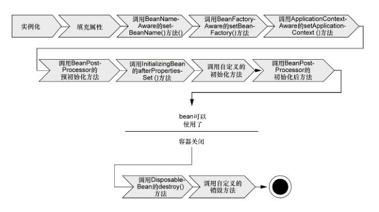

# bean的生命周期



#### 实例化

> Spring对bean进行实例化

#### bean注入

> Spring将值和bean的引用注入到bean对应的属性中


#### 实现BeanNameAware接口

> 如果bean实现了BeanNameAware接口，Spring将bean的ID传递给
setBean-Name()方法；

```java
public interface BeanNameAware extends Aware {
	void setBeanName(String name);

}
```

#### 实现BeanFactoryAware接口

>  如果bean实现了BeanFactoryAware接口，Spring将调
> 用setBeanFactory()方法，将BeanFactory容器实例传入；

```java
public interface BeanFactoryAware extends Aware {
  void setBeanFactory(BeanFactory beanFactory) throws BeansException;
}
```

#### 实现ApplicationContextAware接口

>  如果bean实现了ApplicationContextAware接口，Spring将调
> 用setApplicationContext()方法，将bean所在的应用上下文的
> 引用传入进来；

```java
public interface ApplicationContextAware extends Aware {
	void setApplicationContext(ApplicationContext applicationContext) throws BeansException;

}
```

####  bean实现BeanPostProcessor接口

> 如果bean实现了BeanPostProcessor接口，Spring将调用它们
> 的post-ProcessBeforeInitialization()方法；

```java
public interface BeanPostProcessor {
	Object postProcessBeforeInitialization(Object bean, String beanName) throws BeansException;
    
	Object postProcessAfterInitialization(Object bean, String beanName) throws BeansException;

}

```

#### bean实现InitializingBean接口

> 如果bean实现了InitializingBean接口，Spring将调用它们的after-PropertiesSet()方法。类似地，如果bean使用init-method声明了初始化方法，该方法也会被调用；

```java
public interface InitializingBean {
	void afterPropertiesSet() throws Exception;
}
```

#### bean实现BeanPostProcessor接口

> 如果bean实现了BeanPostProcessor接口，Spring将调用它们的post-ProcessAfterInitialization()方法；

````java
public interface BeanPostProcessor {
	Object postProcessBeforeInitialization(Object bean, String beanName) throws BeansException;
    
	Object postProcessAfterInitialization(Object bean, String beanName) throws BeansException;

}
````

#### bean已经准备就绪

>  此时，bean已经准备就绪，可以被应用程序使用了，它们将一直
> 驻留在应用上下文中，直到该应用上下文被销毁；

#### bean实现DisposableBean接口

> 如果bean实现了DisposableBean接口，Spring将调用它的destroy()接口方法。同样，如果bean使用destroy-method声明了销毁方法，该方法也会被调用。

```java
public interface DisposableBean {
   void destroy() throws Exception;
}
```

